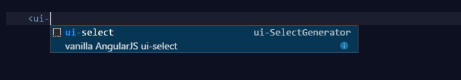

# ui-SelectGenerator README

This is a super simple code snippet extension to provide a common [ui-select](https://angular-ui.github.io/ui-select/) implementation in html files.

## Features

simply begin typing \"<ui-select\" on any page where the file type is specified as html. I opted to not include the leading \"<\" bracket due to issues with intelisense

this same behavior can be done without the extension in vsCode as explained [here](https://code.visualstudio.com/docs/editor/userdefinedsnippets)

## Requirements

none

Users appreciate release notes as you update your extension.